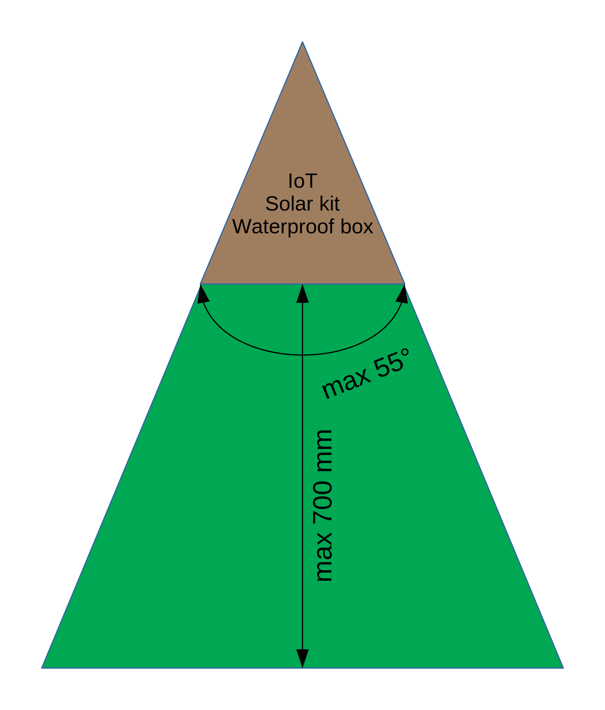

# Deployment guide
*This guide will help you to get quickly the IoT deployed.*

## I. Preparations
### Hardware
First things first, check if you the following things at your disposal:
- [ ] Naturebytes Kit
- [ ] CAT5 UTP cable
- [ ] Power cables
- [ ] Waterproof box
- [ ] 4G router
- [ ] Solar panel
- [ ] Solar charger
- [ ] Lead acid battery
- [ ] Fuse

:exclamation: **If you haven't configured the Naturebytes kit yet, click [here](https://www.github.com/oSoc17/code9000/hardware/SETUP.md).**

:exclamation: **If you don't know which solar kit you need, click [here](https://www.github.com/oSoc17/hardware/SOLARKIT.md).**

### Platform
- The IoT performs the best when it's installed on an island with the **following dimensions**:

  
   
  <i>Island dimensions</i>

- The IoT needs to be **mounted at the same height** as were the birds can land. Most of the time, you can put it on the ground. You only need a tree stump to mount the IoT.

- The IoT **can't be placed directly in the sunlight**, you need to build a roof for it. Too much sunlight will lead to overexposed pictures.

- The solar panel needs to be mounted in an angle of **39° facing South for Ghent, Belgium**.
More details about this are explained [here](https://www.github.com/oSoc17/hardware/SOLARKIT.md).

## II. Install the IoT
-
