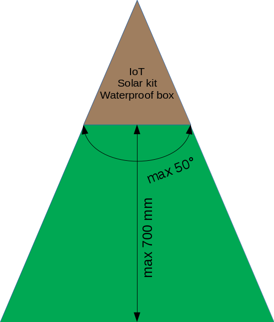

# Deployment guide
*This guide will help you to get quickly the IoT deployed.*

## I. Preparations
### Hardware
First things first, check if you the following things at your disposal:
- [ ] NatureBytes Kit
- [ ] CAT5 UTP cable
- [ ] Power cables
- [ ] Waterproof box
- [ ] 4G router
- [ ] Solar panel
- [ ] Solar charger
- [ ] Lead acid battery
- [ ] Fuse

:exclamation: **If you haven't configured the NatureBytes kit yet, click [here](https://github.com/oSoc17/code9000/blob/develop/hardware/SETUP.md).**

:exclamation: **If you don't know which solar kit you need, click [here](https://github.com/oSoc17/code9000/blob/develop/hardware/SOLARKIT.md).**

### Platform
- The IoT performs the best when it's installed on an island with the **following dimensions**:

  
   
  <i>Island dimensions</i>

- The IoT needs to be **mounted at the same height** as were the birds can land. Most of the time, you can put it on the ground. You only need a tree stump to mount the IoT.

- The IoT **can't be placed directly in the sunlight**, you need to build a roof for it. Too much sunlight will lead to overexposed pictures. You can always put the solar panel on top of the roof.

- The solar panel needs to be mounted in an angle of **39° facing South for Ghent, Belgium**.
More details about this are explained [here](https://github.com/oSoc17/code9000/blob/develop/hardware/SOLARKIT.md). If you are having troubles with building a holder under the right angle you can always buy a holder for your solar panel ([example](http://www.conrad.be/ce/nl/product/110539/Modulehouder-Phaesun-102750?ref=list))

## II. Install the IoT
1. Mount the IoT on a tree stump or something else using the straps delivered with the NatureBytes kit.
2. Connect the ethernet cable, power supply cable to the IoT device.
3. Close the IoT properly and and make sure it's watertight!
4. Switch on the power supply in the waterproof box.
5. Close the waterproof box and make sure it's watertight! You can add a lock for extra security.
6. Fix the waterproof box on the platform.
7. Wait for the IoT until it's completely booted.
8. Test if everything works: power, pictures are taken, pictures arrive at the API, ...
