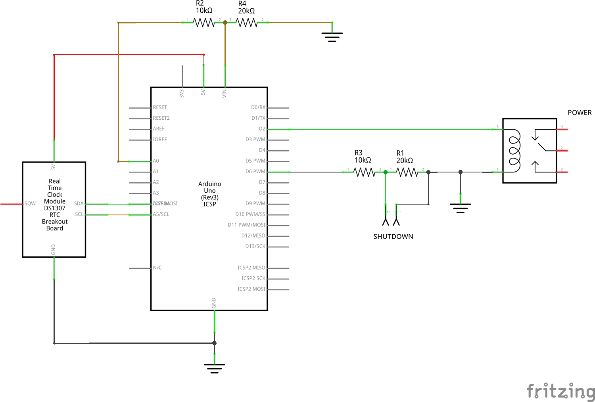
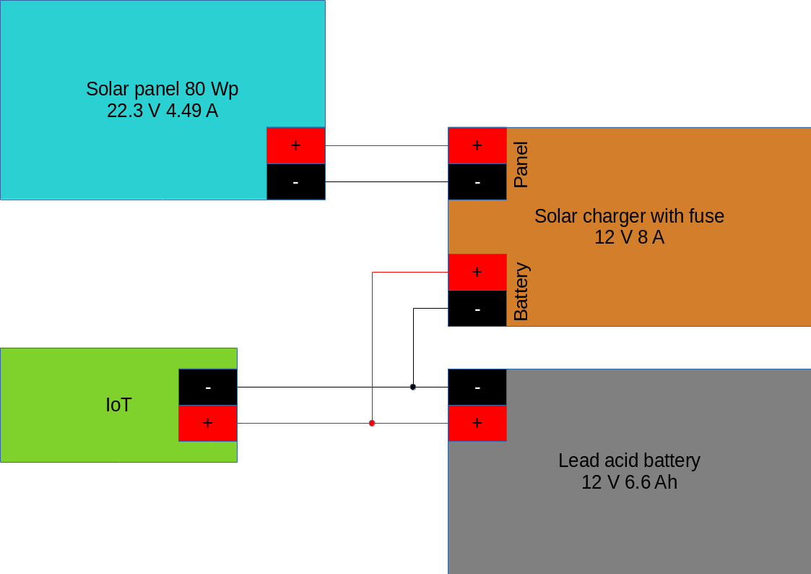
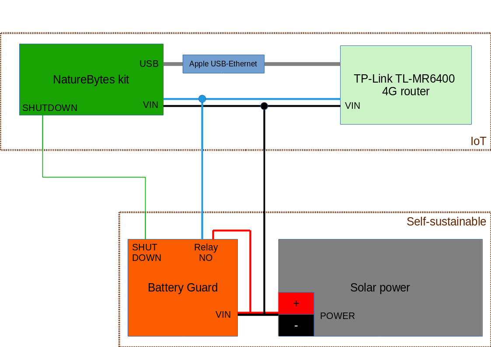

# Setup guide
*This guide will help you to get quickly the IoT it's software installed and configured.*

## I. NatureBytes kit

1. Follow the installation guide from NatureBytes to setup the kit. You can find the guide [here](http://naturebytes.org/downloads/Naturebytes_Wildlife_Cam_Kit_Instructions_AplusPi1_101.pdf).
1. Download the Raspbian OS from the official Raspberry Pi website:
2. Run ```sudo apt-get update && sudo apt-get upgrade -y``` in the terminal to get the Raspberry Pi up to date.
3. Install the following Python module with pip (if not installed):
	- Requests (```sudo pip install requests```)
4. Clone the #code9000 project to the Raspberry Pi:
	- ```sudo apt-get install git```
	- ```git clone https://github.com/osoc17/code9000```
5. Configure the Raspberry Pi: ```sudo raspi-config```
	**Switch to CLI mode**
	- Select ```Boot Options```
	- Select ```Desktop / CLI```
	- Select ```Console Autologin```

	**Enable camera**
	- Select ```Interfacing Options```
	- Select ```Camera```
	- Select ```Yes (enable camera interface) and OK```
IoT
	**Timezone and keyboard layout**
	- Select ```Localisation Options```
	- Select ```Change Timezone```
	- Select ```Select your timezone from the list```
	- Select ```Localisation Options```
	- Select ```Change Keyboard Layout```

	**Splash screen**
	- Select ```Boot Options```
	- Select ```Splash Screen```
	- Select ```No```
	- Exit raspi-config: ```Finish and reboot```
6. Modify ```constants.json``` to your own configuration.
7. Add a crontab entry to launch the shell script when booting
	- Navigate to the launcher.sh path: ```cd /path/to/launcher.sh```
	- Make the script executable: ```chmod +x launcher.sh```
	- Edit crontab table: ```crontab -e```
	- Add this line at the end of the file: ```@reboot sh /path/to/launcher.sh > /path/to/cronlog 2>&1```
	- Close the file using CTRL+X (Nano editor)
	- You should see a message that a new entry was added to the crontab jobs
8. Reboot the Raspberry Pi using ```sudo reboot```
9. If everything goes well, you should see a message in the terminal that we're looking now for birds.
10. To save power, you can disable the HDMI display by adding ```@reboot /opt/vc/bin/tvservice -o``` to the crontab (explained in 6). This setting doesn't survive a reboot.

## II. Battery Guard (Arduino)


1. Build the hardware from the schematic below:<p align="center">
	
	<br>
	<i>Battery Guard schematic</i>
</p>
	:information_source: The shutdown signal and the relay will be connected later in this guide. You can measure the voltage dividers output to check if the circuit is correctly build.
2. Download the [Arduino IDE](https://www.arduino.cc/en/Main/Software) and install it.
3. Install the following Arduino libraries:
	- [DS3231 by NorthernWidget](https://github.com/NorthernWidget/DS3231)
	- [Adafruit SleepyDog by Adafruit](https://github.com/adafruit/Adafruit_SleepyDog)
4. Open the ```powerManager.ino``` script in the Arduino IDE.
5. Configure the script according to your configuration.
6. Flash it on your Arduino. This script is tested **only** on an Arduino UNO R3.

## III. Solar panels & charger

<p align="center">
	
	<br>
	<i>Solar schematic</i>
</p>

1. Connect the solar charger, solar panel and battery correctly according to the instructions from the manufacturer.
2. Setup the router with a SIM card according to the instructions from the manufacturer.
2. Connect the UTP cable between the IoT and the router.
3. Connect the power and signal wires between the Battery Guard and the IoT device while **keeping an eye on the polarity**..
4. Connect the 4G router to the battery while **keeping an eye on the polarity**.
5. Connect the IoT device to the battery while **keeping an eye on the polarity**.
6. If all goes well, the router and the IoT should boot and send the captured pictures to the API you configured in ```constants.json```.

## IV. Hooking it up all together

All the pieces are now ready to be connected with each other, you can find a simple schematic here:

<p align="center">
	
	<br>
	<i>Interconnection schematic</i>
</p>
