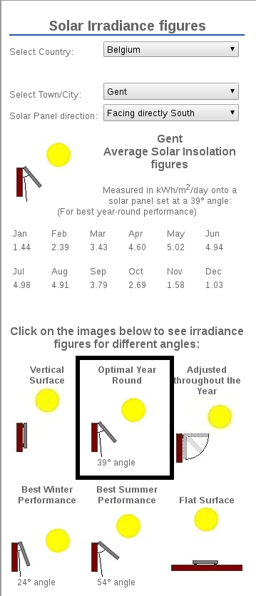

# Solar kit
*This guide will help you to choose the right solar kit for your IoT.*

## I. Solar irradiance
Every place on earth performs differently when it comes to solar panels.
The reason for that is related to the amount of sun, clouds, shadow, ... for that specific place.

You can find out quickly how your solar panel will perform in reality by using historical data.
The website [solarelectricityhandbook.com](http://solarelectricityhandbook.com/solar-irradiance.html) allows you to check out the data easily for almost every location in the world.

We used the 'Optimal Year Round' setting to have the best performance in every season of the year.

<p align="center">
  
  <br>
  <i>Solar irradiance for Ghent, Belgium (<a href="http://solarelectricityhandbook.com/solar-irradiance.html" target="_blank">source</a>)</i>
</p>

If you look at the months we see that December has the lowest amount of sunlight available for Ghent, Belgium: 1030 KWh/m²/day.

<i>Tip: Always use the lowest values to make sure it works in even the worst possible conditions.</i>

## II. Determining technology
Now that we know how much sun light is available we can select our solar kit.
The technology used in the solar panel plays a roll in how efficient the solar panel is (how much sun light will be converted into electricity). Those information should be available in the datasheet of the solar panel provided by the manufacturer. However, our manufacturer didn't provide a detailed datasheet with this information so we used the following chart to determine the efficiency:

<p align="center">
  
  <br>
  <i>Solar efficiency for each technology through the years (<a href="https://en.wikipedia.org/wiki/Solar_cell_efficiency" target="_blank">source</a>)</i>
</p>

We are using a 'Single Crystal' solar panel, the current efficiency is around 25-27 %.

## III. Calculating the solar panel size
1. Measure the voltage of each component that will be connected to the battery charged by the solar panel.
2. Do the same with for the current of each component.
3. We should calculate how much power in Watt's our device will use, this can be done pretty simple using the following formula: ```Power P = Voltage V * Current I```
Do this for every device that will be connected to the battery and take the sum of it.For example: <p><table style="width:100%">
	<tr>
    	<th>Device</th>
    	<th>Voltage</th>
    	<th>Current</th>
		<th>Power</th>
	</tr>
	<tr>
    	<td>Raspberry Pi A+</td>
    	<td>5 V</td>
    	<td>0.15 A</td>
		<td>0.75 W</td>
	</tr>
	<tr>
		<td>TP-Link TL-MR6400 (4G router)</td>
		<td>12 V</td>
		<td>0.15 A</td>
		<td>1.80 W</td>
	</tr>
</table>

<b>TOTAL: 2.55 W power consumption for all the devices connected to the battery.</b></p>

4. Now we need to take the efficiency of the solar panel and DC-DC convertor into account. Since our battery works on 12 V we need to convert it into 5 V to power the Raspberry Pi A+. These convertors have an efficiency between 75-85%. To combine the efficiencies you need to multiply them:

```TOTAL EFFICIENCY = PANEL EFFICIENCY * DC-DC EFFICIENCY```


We will do this for our example above: <b>TOTAL= 0.25 * 0.75 = 0.19 (19 %)</b>

<i>Tip: Always use the lowest values to make sure it works in even the worst possible conditions.</i>

5. Do you want to run the device 24/24 or not? The amount of hours/day is important to determine how much the devices will consume of the battery. In our case, the device only needs to running during the day (12 hours).

6. The actual size of the solar panel is determined by the efficiency, the power consumption of the devices, the amount of sunlight available for your location and how long the devices need to be active, let's bring them together!
Convert the power consumption calculated in step 3 to Wh/day with this formula:
```POWER USED DAY = POWER CONSUMPTION * HOURS OF OPERATION```
In our example: <b>CONSUMPTION EACH DAY = 2.55 W * 12 hours = 30.6 Wh/day</b> We use the famous '[Rule of Three](https://en.wikipedia.org/wiki/Cross-multiplication#Rule_of_Three)' for this. For example: <table style="width:100%">
	<tr>
		<th>Available power</th>
		<th>Panel size</th>
	</tr>
	<tr>
		<td>1030 Wh/day</td>
		<td>1 m²</td>
	</tr>
	<tr>
		<td>1 Wh/day</td>
		<td>0.000970874 m²</td>
	</tr>
	<tr>
		<td>30.6 Wh/day</td>
		<td>0.029708738 m²</td>
	</tr>
</table>
But we forgot something! The efficiency we calculated in step 5! We can do that using this formula:

```ACTUAL SIZE = CALCULATED SIZE * TOTAL EFFICIENCY```


For example: <b>ACTUAL SIZE = 0.029708738 m²/0.19 = 0.16 m²</b>

## IV. Conclusion
Using the calculations above, we determined that we need to buy a solar panel with a size of at least 0.16 m² for our example. It's always advised to add some overhead as a reserve.
